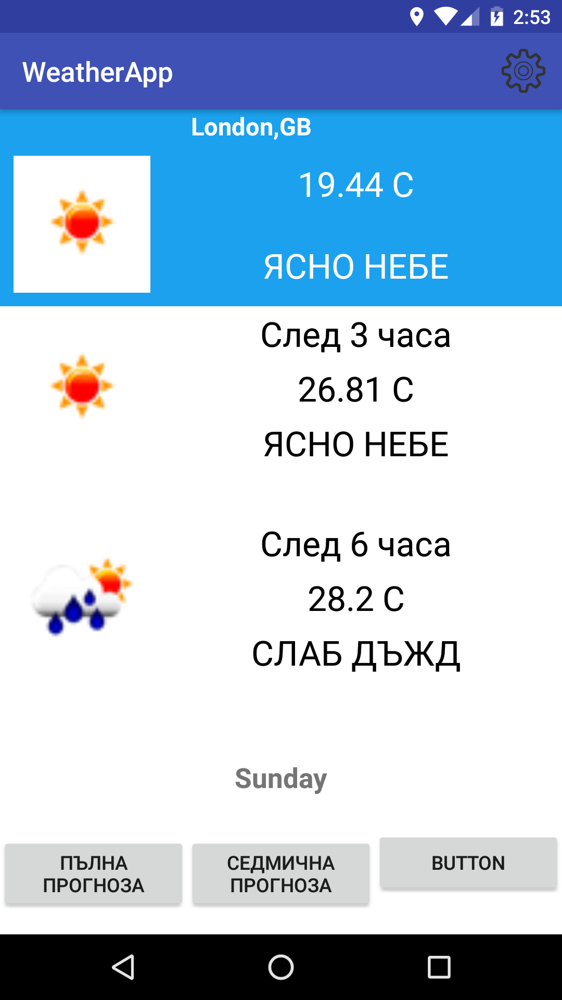
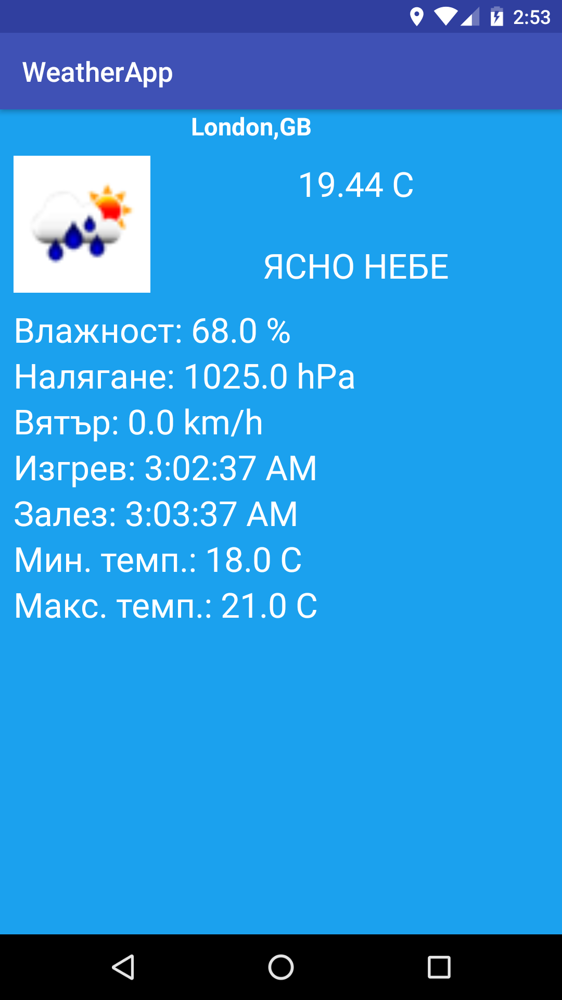
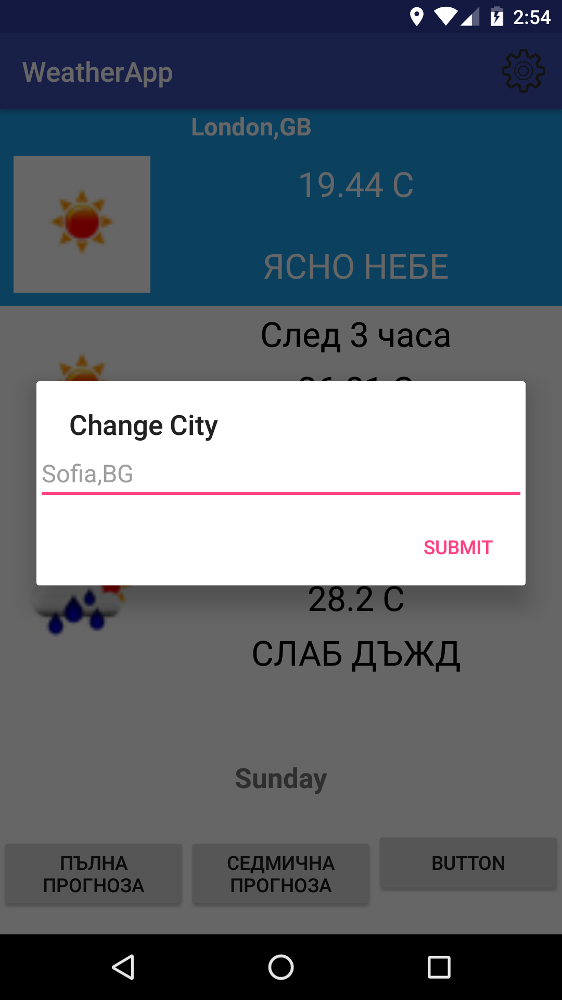

> Проект по Мобилни приложения

Android weather application

> Изготвил:
>
> Лазар Дилов
>
> Ръководител: ас. Христо Христов
>
> *1.Постановка* *на* *задачата*

Трябва да се направи приложение, което да извлича информация за
метеорологичната прогноза на даден район. За тази цел е необходим
източник, който да предоставя актуална информация за меоторологичната
обстановка на конкретно селище. За целта съм използвал OpenWeather. Те
предоставят API чрез което мога да извлека необходимите данни за
определен град. Данните се взимат в JSON формат. OpenWeather са така
добри и предоставят дори графично изображение на времето навън.

> *2.Описание* *на* *реализацията*
>
> За целта съм използвал 3 пакета (packages):

-   Data

    -   CitySettings

    -   ImageHTTPClient

    -   LocationHTTPClient

    -   WeatherHTTPClient

    -   JSONParser

-   Model

    -   Clouds

    -   CurrentCondition

    -   GeoLocation

    -   Location

    -   Snow

    -   Temperature

    -   Weather

    -   Wind

-   Utility

    -   Utils

Белите точки са класовете в пакетите, а пакетите са изобразени с черни
точки.

Класът Utils служи за някои основни методи. От него имаме методи за
извличане на стойности от JSON данните някои от базовите типове данни.

В пакета Model имаме класове, които представляват „моделите“ (в смисъла
на модел от MVC приложение) на различните характеристики на времето.

Пакетът data е аналогия на Controller (от MVC) и съдържа няколко класа.

**WeatherHttpClient** e клас който осъществява връзката с API-то на
OpenWeather. Чрез него ние теглим данните и ги предаваме като символен
низ в JSON формат.

**LocationHttpClient** е като предишния клас. Той работи на същия
принцип. Целта му е чрез http връзка да изтегли данните за локацията.
Използвам Google location API които по дадена дължина и широчина
(latitude, longitude) ни предоставят държавата и града в който се
намираме. Разбира се координатите ги взимаме от GPS-a на устройството.
Данните отново се връщат като String в JSON формат.

**ImageHttpClient** е аналогичен на предишните два класа. Връща
резултата в Bitmap формат тъй като искаме да извлечем графичното
представяне на времето (като иконка).

**JSONParser** има три метода. Основните са два от тях: getWeather() и
getLocationData(). Първият записва съответните стойности за различните
метеорологични характеристики в съответния модел. Данните се взимат от
извлечения String от WeatherHttpClient. Парсват се до JSONObject и
извличаме стойностите (обикновено float или String). После ги записваме
в съответния модел. Вторият метод прави подобни неща, само че записва
данните в модела GeoLocation и го връща като резултат.

В **MainActivity.java** (сърцето на програмата) изпозлваме всичките
класове до момента. Инициализираме полетата. Изискваме права за достъп
до текущата локация. Пускаме LocationListener който работи като фонов
процес и следи за промяна на локацията. В момента в който тя се промени,
ние я обновяваме и взимаме времето за новата локация. Изпълняваме метода
**renderWeatherData()**. Той от своя страна пуска като фонови процеси
WeatherTask и WeatherHourlyTask. Първата задача извлича данните за
времето в момента на background. Втората прави същото но за времето след
3 часа и след 6 часа. Двете задачи използват за целта WeatherHttpClient
като го пускат да работи в background, за да не се налага главната
нишка, която отговаря за графични интерфейс, да изчаква. Двете задачи
наследяват класа AsyncTask.

Аналогично пускаме и GeoLocationTask, който тегли информация за града и
държавата, на която отговаря текущата локация.

Всеки WeatherTask пуска от своя страна DownloadImageTask.
DownloadImageTask използва ImageHttpClient за да свали графичното
изображение на текущото време.

Програмата има и опция за подробна прогноза в която използваме второ
Activity на което предаваме изтеглената от MainActivity информация. След
това изобразяваме цялата информация върху екрана.

*3.Снимки*

> 
>
> 

*3.Изисквания*

Изисква се Android v.7.1

*4. За разработчици*

Използвано е Android studio 2.3.2
